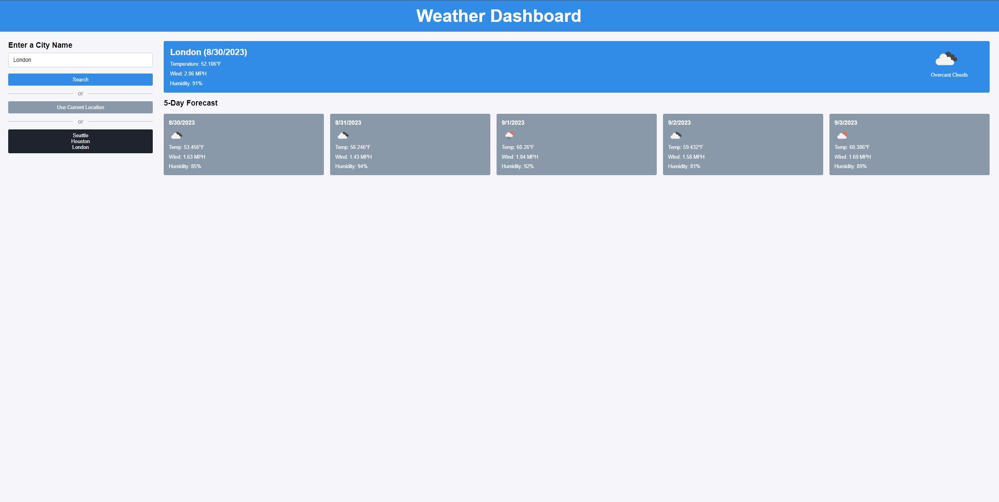

# Weather Dashboard
This application allows you to check the current weather and 5-day forecast for various cities. Whether you're planning a trip or just curious about the weather, this app has got you covered.

For source code, visit my Github repo @ [Weather Dashboard](https://github.com/mxrtinee/Weather-Dashboard/)


## User Story

```
AS A traveler
I WANT to see the weather outlook for multiple cities
SO THAT I can plan a trip accordingly
```

## Acceptance Criteria

```
GIVEN a weather dashboard with form inputs
WHEN I search for a city
THEN I am presented with current and future conditions for that city and that city is added to the search history
WHEN I view current weather conditions for that city
THEN I am presented with the city name, the date, an icon representation of weather conditions, the temperature, the humidity, and the wind speed
WHEN I view future weather conditions for that city
THEN I am presented with a 5-day forecast that displays the date, an icon representation of weather conditions, the temperature, the wind speed, and the humidity
WHEN I click on a city in the search history
THEN I am again presented with current and future conditions for that city
```
## Screenshot

The following image shows the web application's appearance and functionality:



Please see the live webpage link for you to checkout. [Link](https://mxrtinee.github.io/Weather-Dashboard/)

## How to Use

1. **Search for a City:**
   - Enter the name of a city in the input field provided.
   - Click the "Search" button to view weather information for that city.
   
2. **View Current Weather:**
   - Once you've searched for a city, the current weather conditions will be displayed.
   - You'll see the city name, date, weather icon, temperature, humidity, and wind speed.
   
3. **View 5-Day Forecast:**
   - Scroll down to the "5-Day Forecast" section to see the weather outlook for the next 5 days.
   - Each day will show the date, weather icon, temperature, wind speed, and humidity.

4. **Use Current Location:**
   - If you want to view weather data for your current location, click the "Use Current Location" button.
   - The app will fetch weather information for your current coordinates.

5. **Search History:**
   - Your search history will be displayed in a list on the left side of the screen.
   - Click on a previously searched city to quickly view its weather data again.


## Built With
HTML<br>
CSS<br>
JavaScript<br>
OpenWeather API